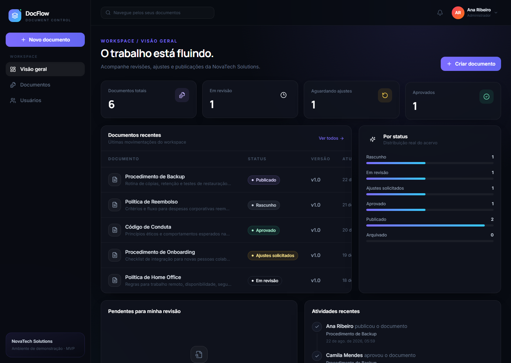
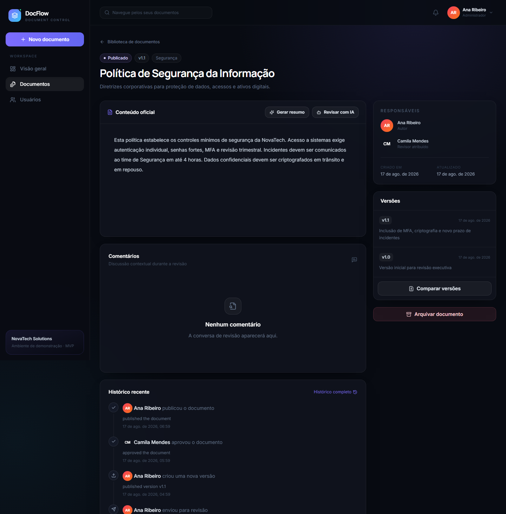

# DocFlow

[](https://github.com/Leandrosp9/webapp-docflow/actions/workflows/ci.yml)
[](LICENSE)

> Plataforma empresarial para gestão, revisão, aprovação e versionamento de documentos.

## Visão geral

O DocFlow é um SaaS multi-tenant de aprovação documental criado como um MVP enxuto e funcional. Ele centraliza documentos de texto e PDF, define uma versão oficial, organiza revisões formais e preserva uma trilha completa das decisões.

O projeto demonstra uma aplicação full-stack pronta para portfólio, conversas com clientes e evolução futura sem transformar o MVP em um sistema empresarial excessivamente grande.

## O problema

Documentos corporativos frequentemente ficam dispersos entre e-mail, WhatsApp, Google Drive, pastas de rede e computadores pessoais. Esse cenário cria dúvidas sobre qual versão é oficial, aprovações informais, revisões perdidas e nenhuma rastreabilidade clara sobre autoria ou decisões.

## A solução

O DocFlow concentra o ciclo de vida do documento em um único fluxo auditável:

```text
Criar documento
      ↓
Enviar para revisão
      ↓
Revisor analisa
      ↓
Aprovar ou solicitar ajustes
      ↓
Nova versão quando necessário
      ↓
Aprovação final
      ↓
Documento publicado
      ↓
Histórico completo
```

As transições de estado, permissões e fronteiras entre empresas são validadas na API. O frontend mostra apenas ações disponíveis, mas nunca é tratado como fonte de autorização.

## Funcionalidades

- autenticação com access token, refresh token e logout;
- perfis `ADMIN` e `COLLABORATOR` com RBAC no backend;
- isolamento multi-tenant derivado do usuário autenticado;
- documentos de texto criados dentro da plataforma;
- upload, visualização e download autenticado de PDF;
- versões imutáveis com resumo das alterações;
- fluxo de revisão com transições de estado validadas;
- comentários durante a revisão;
- trilha de auditoria por documento;
- dashboard construído com dados reais;
- busca e filtros por status, categoria e autor;
- seed idempotente com dados profissionais de demonstração;
- feedback de loading, skeleton, toast, erro, vazio e confirmação;
- interface responsiva para desktop, notebook, tablet e celular.

## Funcionalidades de IA

A integração usa o Gemini em nuvem por meio de uma abstração no backend. A chave nunca é enviada ao navegador.

1. **Revisar com IA:** aponta problemas, trechos confusos, sugestões e riscos de ambiguidade sem alterar o documento.
2. **Gerar resumo com IA:** cria um resumo curto e objetivo da versão escolhida.
3. **Comparar versões com IA:** explica adições, remoções, mudanças e impacto provável.

A comparação textual simples é sempre calculada localmente pela aplicação. A IA apenas explica diferenças já verificáveis. Sem `GEMINI_API_KEY`, o restante do MVP continua funcionando e as rotas de IA retornam um erro controlado.

## Fluxo de aprovação

Os estados disponíveis são `DRAFT`, `IN_REVIEW`, `CHANGES_REQUESTED`, `APPROVED`, `PUBLISHED` e `ARCHIVED`.

- autor ou administrador: `DRAFT`/`CHANGES_REQUESTED` → `IN_REVIEW`;
- revisor atribuído ou administrador: `IN_REVIEW` → `APPROVED`;
- revisor atribuído ou administrador: `IN_REVIEW` → `CHANGES_REQUESTED`;
- somente administrador: `APPROVED` → `PUBLISHED`;
- somente administrador: documento ativo → `ARCHIVED`.

Operações inválidas retornam erro `409` e não alteram o documento.

## Stack tecnológica

**Frontend:** React, Vite, JavaScript, Tailwind CSS, Lucide React, React Router, TanStack Query, React Hook Form, Zod e Framer Motion.

**Backend:** Python, FastAPI, SQLAlchemy 2, Pydantic, Alembic e PostgreSQL.

**Qualidade e infraestrutura:** Pytest, Vitest, React Testing Library, Playwright, Ruff, ESLint, Prettier, Docker Compose e GitHub Actions.

**IA:** Gemini API em nuvem. Não há IA local, Ollama, RAG ou embeddings.

## Arquitetura

```text
frontend (React/Vite)
        │ HTTP /api/v1
        ▼
backend (FastAPI)
  ├── autenticação e RBAC
  ├── serviços de domínio e workflow
  ├── repositórios com filtro de tenant
  ├── FileStorage → armazenamento local
  └── AIService → Gemini API
        │
        ▼
PostgreSQL + Alembic
```

```text
backend/app/
├── api/            # routers e dependências HTTP
├── core/           # configuração, segurança, erros e logs
├── models/         # entidades SQLAlchemy
├── schemas/        # contratos Pydantic
├── repositories/   # acesso a dados com escopo de tenant
├── services/       # regras de negócio e transições
├── ai/             # abstração e provider Gemini
├── storage/        # abstração e implementação de arquivos
└── middleware/     # request ID e observabilidade
```

## Capturas de tela

### Dashboard



### Detalhes do documento



As capturas acima foram geradas automaticamente a partir do ambiente Docker validado com `npm run screenshots`.

## Demonstração

Empresa: **NovaTech Solutions**

| Perfil | E-mail | Senha |
| --- | --- | --- |
| Administrador | `admin@docflow.demo` | `DocFlowDemo2026!` |
| Colaborador | `collaborator@docflow.demo` | `DocFlowDemo2026!` |

O seed inclui seis documentos profissionais em diferentes estados, versões e eventos de histórico.

## Executando localmente

### Docker Compose — recomendado

Pré-requisitos: Docker Desktop com Docker Compose.

```bash
git clone https://github.com/Leandrosp9/webapp-docflow.git
cd webapp-docflow
docker compose up --build
```

Após os healthchecks:

- aplicação: [http://localhost:5173](http://localhost:5173)
- API: [http://localhost:8000](http://localhost:8000)
- documentação da API: [http://localhost:8000/docs](http://localhost:8000/docs)
- healthcheck: [http://localhost:8000/health](http://localhost:8000/health)

As migrations e o seed idempotente são executados automaticamente na inicialização do backend.

### Desenvolvimento sem Docker para aplicação

O PostgreSQL ainda precisa estar disponível e `DATABASE_URL` deve apontar para ele.

```bash
# backend
cd backend
python -m venv .venv
.venv/Scripts/pip install -r requirements-dev.txt
alembic upgrade head
python -m app.db.seed
uvicorn app.main:app --reload

# frontend, em outro terminal
cd frontend
npm ci
npm run dev
```

No Linux ou macOS, ative o ambiente virtual com `source .venv/bin/activate` e use os executáveis correspondentes.

## Variáveis de ambiente

Copie [`.env.example`](.env.example) para `.env` e substitua apenas valores locais. O arquivo `.env` é ignorado pelo Git.

| Variável | Uso |
| --- | --- |
| `DATABASE_URL` | conexão SQLAlchemy com PostgreSQL |
| `JWT_SECRET` | assinatura dos access tokens |
| `ACCESS_TOKEN_MINUTES` | duração do access token |
| `REFRESH_TOKEN_DAYS` | duração do refresh token |
| `GEMINI_API_KEY` | chave opcional da API Gemini |
| `GEMINI_MODEL` | modelo Gemini usado pelo provider |
| `CORS_ORIGINS` | origens autorizadas, separadas por vírgula |
| `MAX_UPLOAD_MB` | limite de PDF |
| `VITE_API_URL` | base pública da API usada pelo frontend |
| `BACKEND_PORT` | porta local exposta pela API no Compose |
| `FRONTEND_PORT` | porta local exposta pelo frontend no Compose |

O `docker-compose.yml` possui valores locais de demonstração, não credenciais de produção. Em produção, injete todos os segredos por um gerenciador apropriado.

## Testes

```bash
# backend
cd backend
ruff check .
pytest --cov=app --cov-report=term-missing

# frontend
cd frontend
npm run lint
npm run format
npm test
npm run build

# E2E com o ambiente Docker ativo
npm run e2e
```

Os testes backend cobrem autenticação, RBAC, isolamento de tenant, CRUD, versões, workflow, transição inválida, comentários, histórico, IA mockada e upload. Os testes frontend cobrem login, listagem, detalhe e ações de revisão. O Playwright valida três fluxos sequenciais completos.

## Segurança

- senhas protegidas com Argon2;
- tokens de refresh armazenados apenas como hash;
- consultas de documento sempre limitadas pela empresa autenticada;
- `company_id` nunca é aceito dos schemas públicos;
- validação de MIME, assinatura `%PDF-` e limite de tamanho;
- download de arquivo exige autenticação e acesso ao tenant;
- CORS configurável;
- erros padronizados com request ID;
- logs estruturados sem senha, token, chave ou conteúdo completo;
- secrets somente por variáveis de ambiente;
- stack traces ocultos nas respostas de produção;
- dependências frontend auditadas com `npm audit`.

Formato de erro:

```json
{
  "error": {
    "code": "DOCUMENT_NOT_FOUND",
    "message": "Document not found",
    "request_id": "..."
  }
}
```

## Roadmap

- assinaturas digitais;
- SSO empresarial;
- notificações;
- cadeias avançadas de aprovação;
- suporte a DOCX;
- integrações com armazenamento externo.

Esses itens são ideias futuras e não fazem parte do MVP atual.

## Licença

Distribuído sob a [Licença MIT](LICENSE).
